<h1>Android Devlopment</h1>

<h3> Each day works are kept in respective branch   Master branch contains the latest work   All the images are stored in the Project_ss directory    </h3>
<h2> Thank you </h2>

 

Day 14

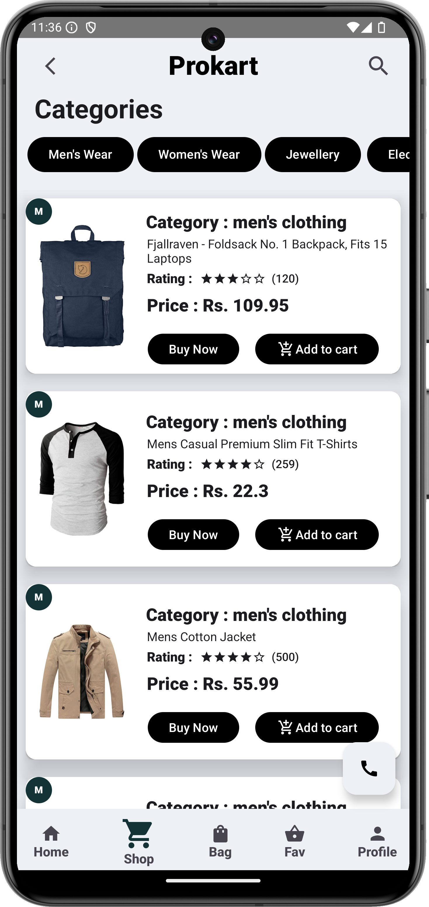

Day 13

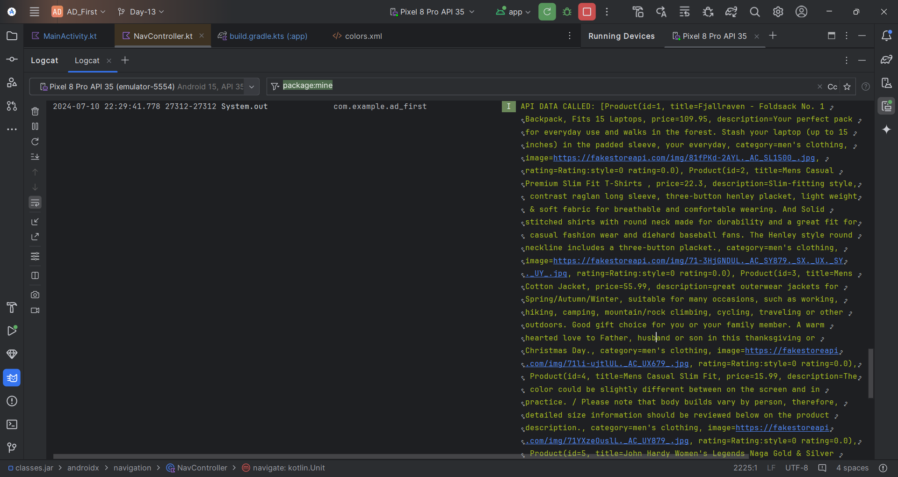

Day 12

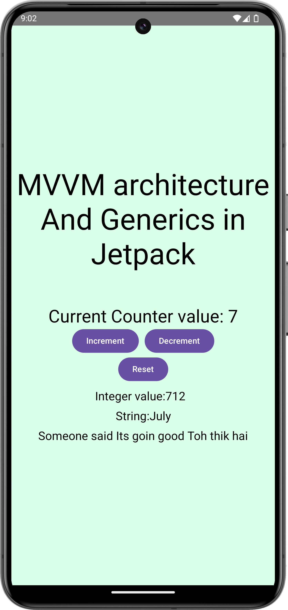

<h2> Day 11 </h2>
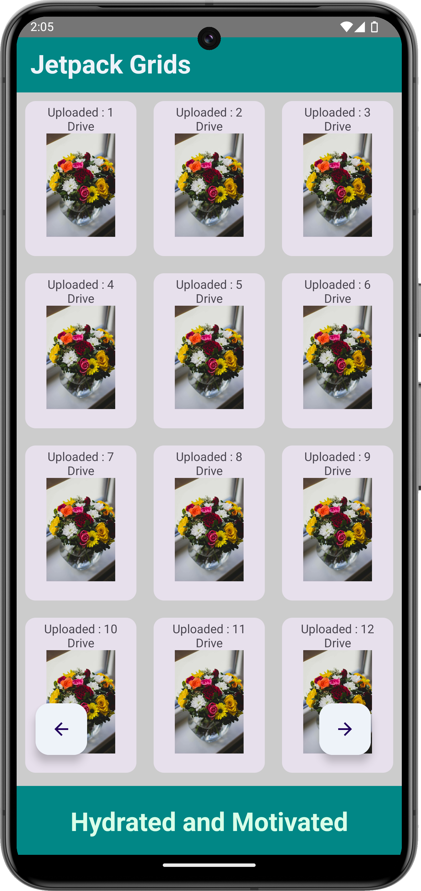

Day 10 [Task 1]

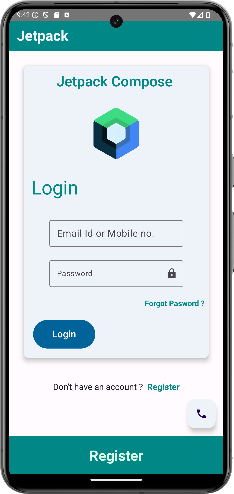

Day 9

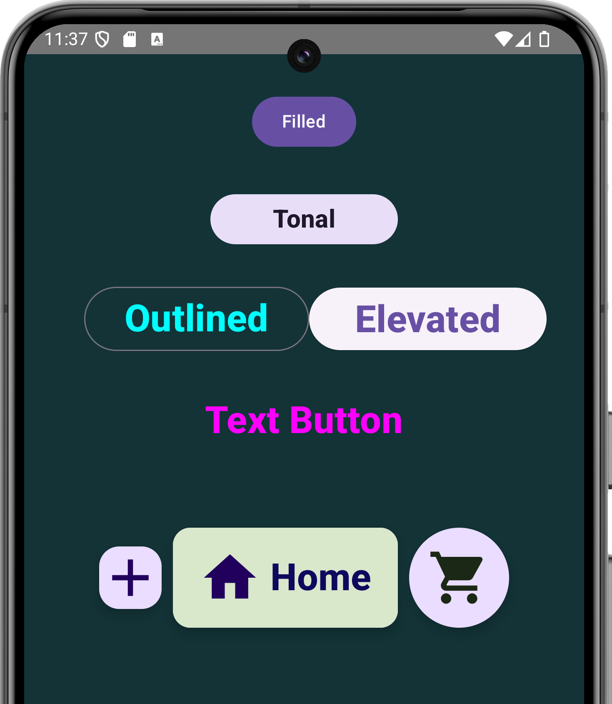
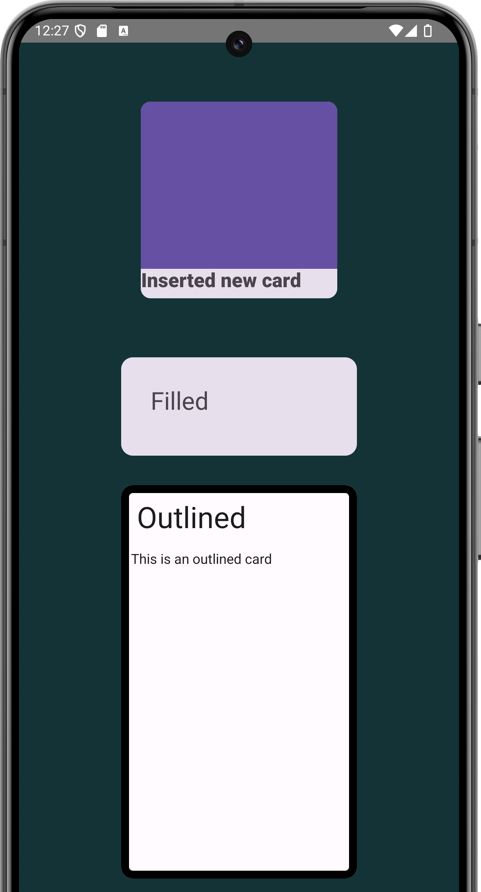
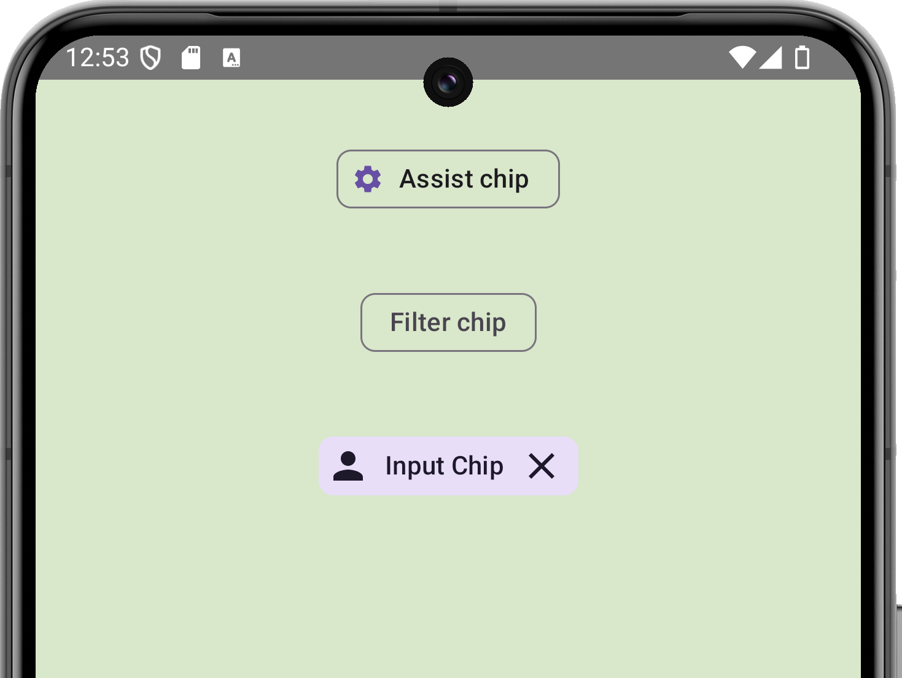
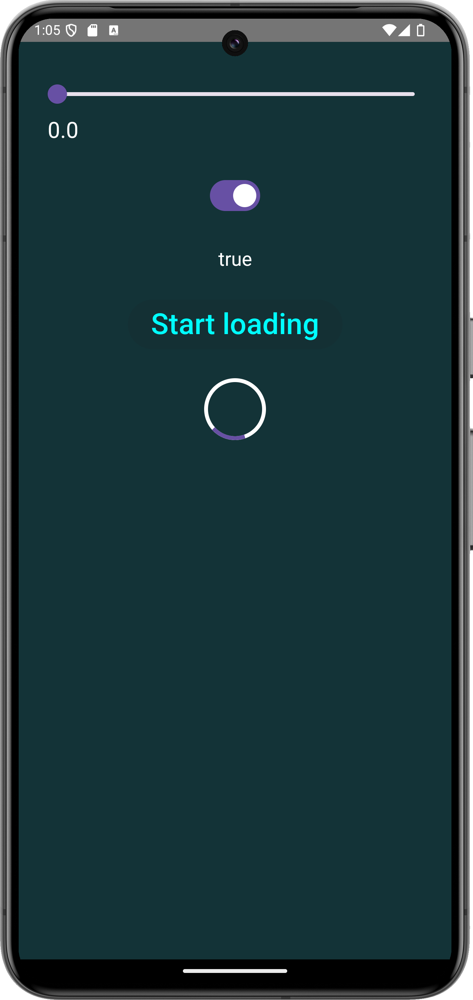
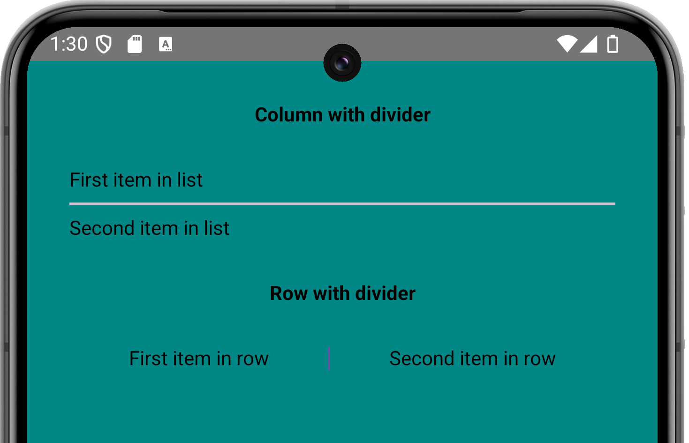
 

Day 8

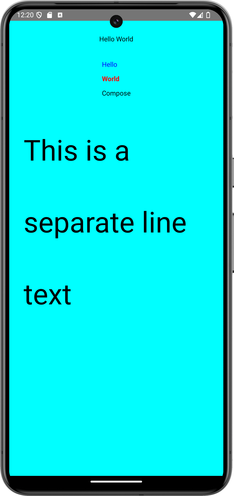
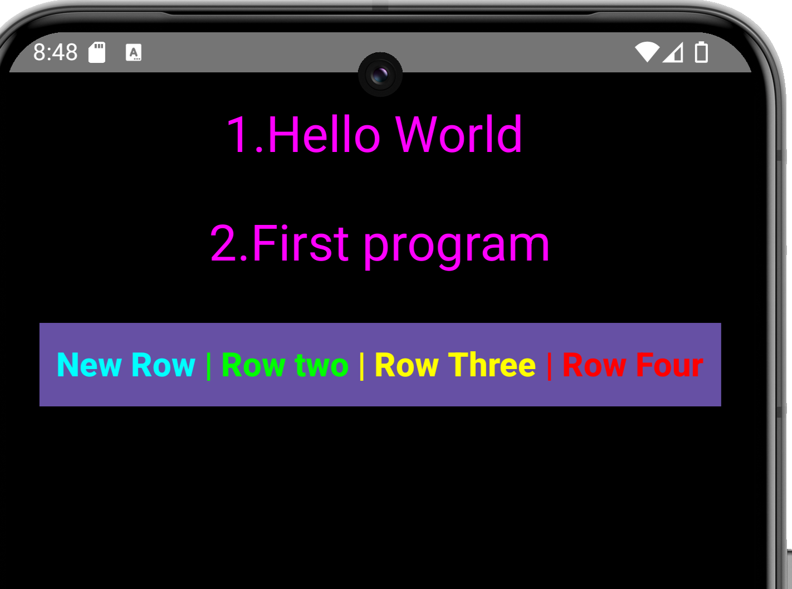
 

Day 7

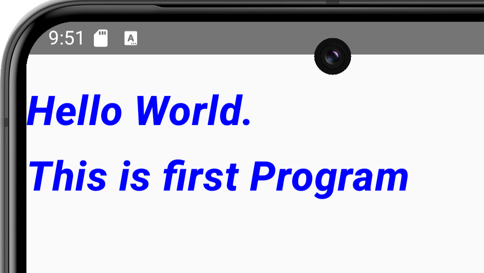
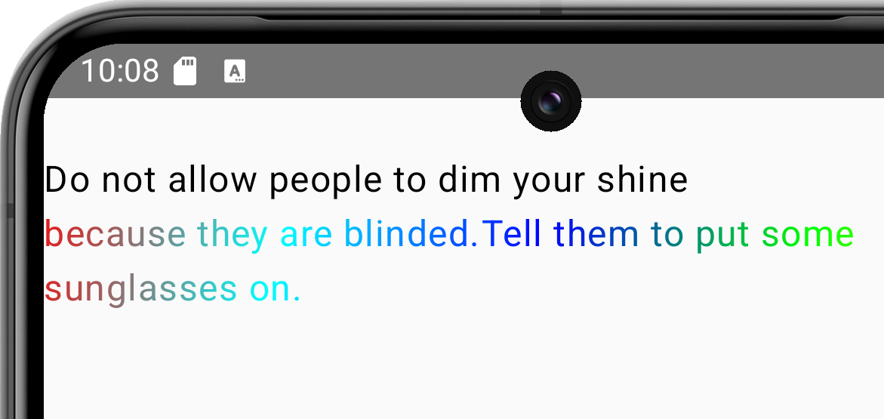
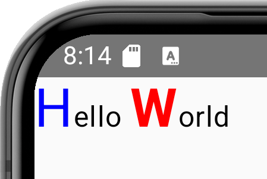
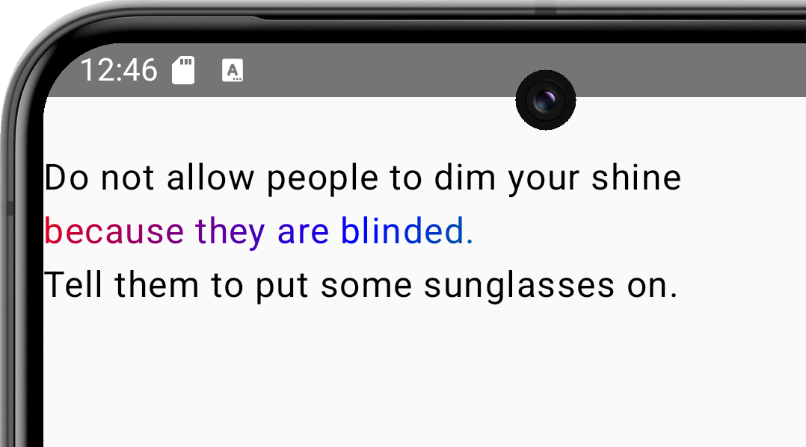
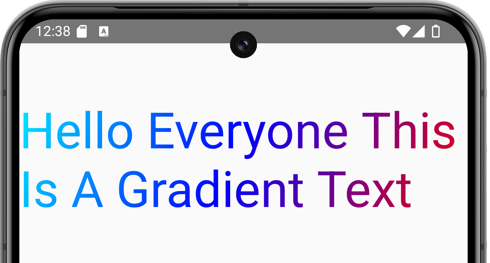
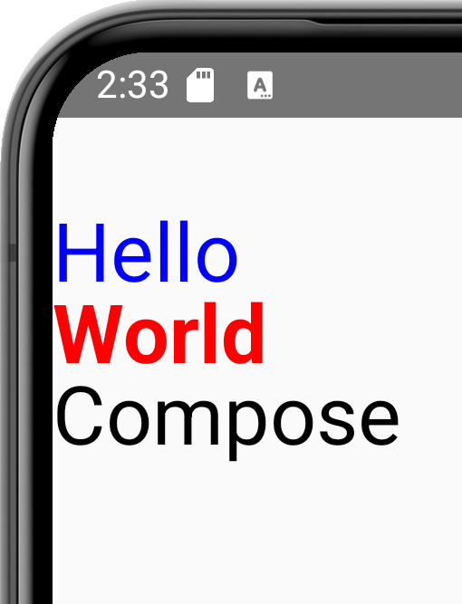
